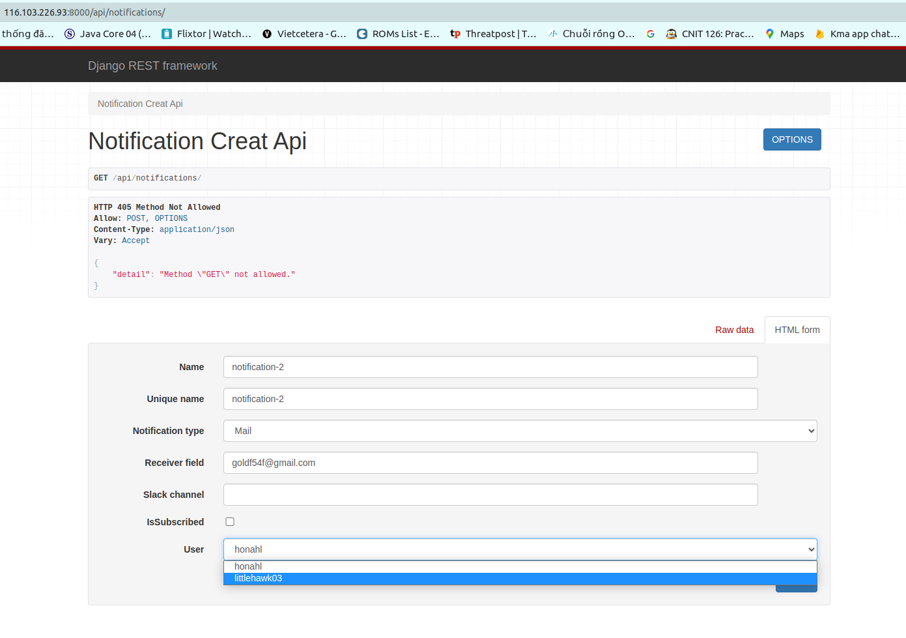
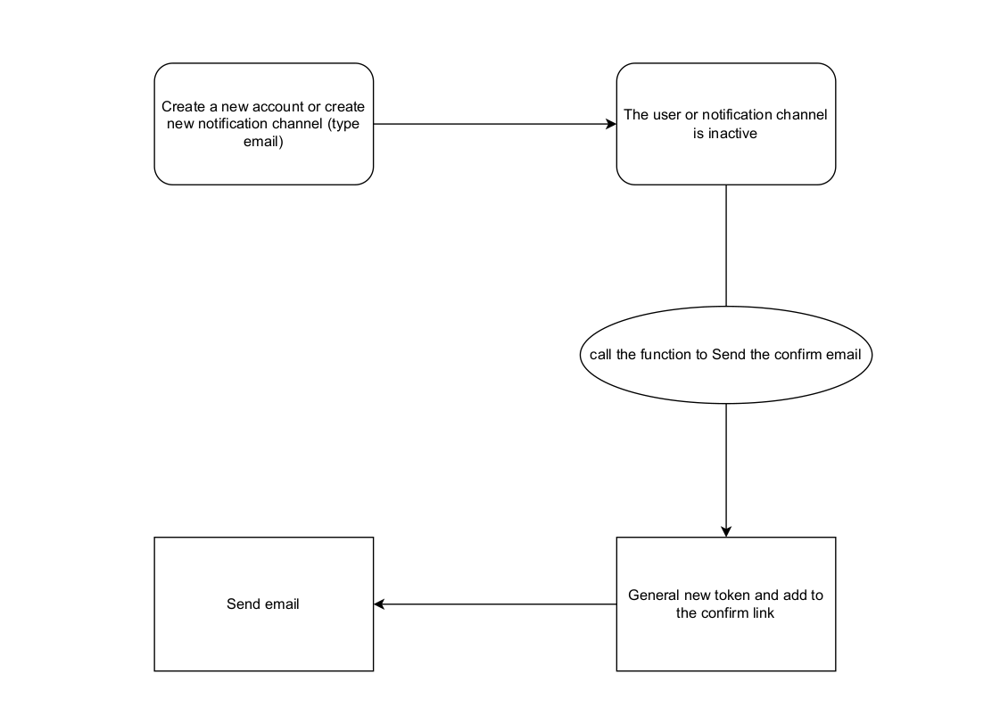
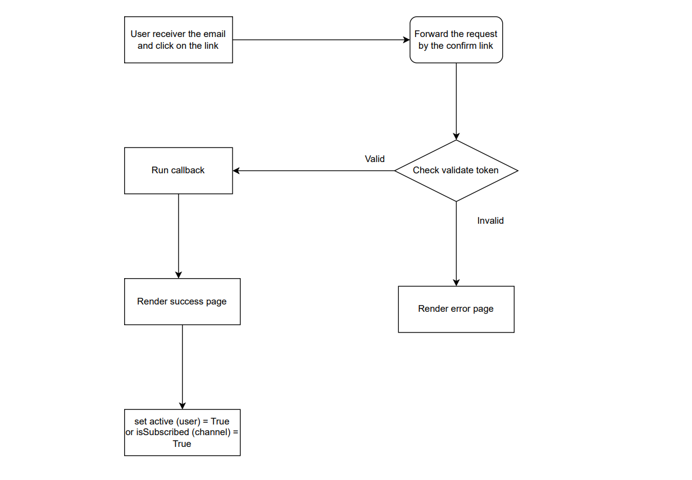

# Issues 3 - Notification as a service


### Table of content

1. [Building a Django model](#a1)
    - [1.1 Users models](#1.1) 
        - [1.1.2 Create new user](#1.1.2)
        - [1.1.3 Get all users](#1.1.3)
        - [1.1.4 Get the specific user](#1.1.4)
        - [1.1.5 Update and Delete specific user](#1.1.5)
    - [1.2 Notification Channel models](#1.2)
        - [1.2.1 Create new notification channel](#1.2.1)
        - [1.2.2 Get all notification channel](#1.2.2)
        - [1.2.3 Get specific notification channel](#1.2.3)
        - [1.2.4 Update and Delete specific use](#1.2.4)
    - [1.3 Django Email Verification](#1.3)
        - [ 1.3.1 General concept](#1.3.1)
        - [1.3.2 General new token](#1.3.2)
        - [1.3.3 Check validate token](#1.3.3)


<a name='a1'></a>

## 1. Building a Django model

<a name='1.1'></a>

### 1.1 Users models

Design a model **User**(name, username, email, gender, location, date_of_birth, account_create_date, active)

<div align="center">
  
</div>

the **models.py**

```python
    from django.db import models
    class Users(models.Model):
        class GenderChoice(models.TextChoices):
            MALE = 'male', 'Male'
            FEMALE = 'female', 'Female'
            OTHER = 'other',
        
        name = models.CharField(max_length=100)
        username = models.CharField(max_length=30,unique=True,null=True)
        email = models.EmailField(unique=True)
        gender = models.CharField(max_length=15,choices=GenderChoice.choices,default=GenderChoice.MALE)
        location = models.CharField(max_length=100,blank=True)
        date_of_birth = models.DateField()
        account_create_date = models.DateTimeField(auto_now_add=True, auto_now=False, blank=True)
        active = models.BooleanField(default=False)
        
        def __str__(self) :
            return self.username
```

Cấu hình file backend/users/**serializers.py** và backend/users/**views.py**để tạo một APIView để thực hiện các chứ năng POST, GET, PUT, DELETE users

<a name='1.1.2'></a>

##### 1.1.2 Create new user

Để có thể  tạo một user mới ta sử dụng phương thức POST (có thể sử dụng POSTMAN hoặc vào trực tiếp URL sau) :

```sh
    http://116.103.226.93:8000/api/users/
```

Thêm các thông tin cần thiết 

<div align="center">
  
</div>

Sau khi tạo một user mới người dùng đó sẽ nhận được một email kèm đường link confirm

<div align="center">
  
</div>

<div align="center">
  
</div>

Sau khi bấm vào đường link thì thuộc tính ```active``` sẽ được set giá trị ```True```

<a name='1.1.3'></a>

##### 1.1.3 Get all users

Lấy toàn bộ dữ liệu của tất cả những người dùng sử dụng phương thức GET và có url:

```sh
    http://116.103.226.93:8000/api/users/lists/
```

<div align="center">
  
</div>

<a name='1.1.4'></a>

##### 1.1.4 Get the specific user

Lấy toàn bộ dữ liệu của một người dùng cụ thể dùng sử dụng phương thức GET theo id của người dùng và có url (có thể mở rông thành tìm người dùng theo một số trường nhất địng chỉ cần thay queryset):

```sh
    http://116.103.226.93:8000/api/users/<id:pk>/
```

<div align="center">
  
</div>

<a name='1.1.5'></a>

##### 1.1.5 Update and Delete specific user

Sửa hoặc xóa người dùng cụ thể :

Sửa người dùng phương thức PUT và url là :

```sh
    http://116.103.226.93:8000/api/users/update/<id:pk>/
```

Xóa người dùng cụ thể sử dụng phương thức delete và url là :

```sh
    http://116.103.226.93:8000/api/users/delete/<id:pk>/
```

<a name='1.2'></a>

### 1.2 Notification Channel models

Design a model **notification_channel**(name ,unique_name ,notification_type ,receiver_field ,slack_channel ,isSubscribed ,user)

<div align="center">
  
</div>

```python
    from django.db import models

from users.models import Users

# Create your models here.
class NotificationChannel(models.Model):
    
    class TypeChoice(models.TextChoices):
        EMAIL = 'email', 'Mail'
        WEBHOOK = 'webhook', 'Webhook'
        SMS = 'sms', 'SMS' 
        SLACK = 'slack', 'Slack'
    # name of notification channel, it can be set or be blank (not require) 
    name = models.CharField(max_length=100,blank=True)
    # the unique name (* required because it use for query or select from user) 
    unique_name = models.CharField(max_length=100,unique=True)
    # notification type (it can be email,weebhook, sms and slack)
    notification_type = models.CharField(max_length=30,choices=TypeChoice.choices,default=TypeChoice.EMAIL)
    # include email address, webhook url, slack webhook url
    receiver_field = models.CharField(max_length=200,null=False)
    # slack channel if notification type is slack
    slack_channel = models.CharField(max_length=50,blank=True)
    # after verify the "isSubcribed" will be true
    isSubscribed = models.BooleanField(default=False)
    user = models.ForeignKey(Users,on_delete=models.CASCADE,related_name='notification_channel')
    
    def __str__(self) :
        return self.username
```

Cấu hình file serializers.py và views.pyđể tạo một APIView để thực hiện các chứ năng POST, GET, PUT, DELETE users

<a name='1.2.1'></a>

##### 1.2.1 Create new notification channel

Tạo một Notification Channel mới ta sử dụng phương thức POST và url là :

```sh
    http://116.103.226.93:8000/api/notifications/

```
<div align="center">
  
</div>


tại phần notification type có thể chọn nhiều loại notifcation mà mình muốn như là email, slack, webhook, telegram, ..... và khi chọn và nhập vào receiver field thì tất cả các type này đều đưởn gưi một đường link xác nhận muốn nhận thông báo. Ở đây thử nghiệm email

<div align="center">
  
</div>


bấm vào đường link sẽ xác nhận tạo notification mới

<a name='1.2.2'></a>

##### 1.2.2 Get all notification channel

để lấy được toàn bộ thông tin của tất cả các notification channel thì truy cập vào url:

```sh
    http://116.103.226.93:8000/api/notifications/lists/
```

<div align="center">
  
</div>

<a name='1.2.3'></a>

##### 1.2.3 Get specific notification channel

```sh
    http://116.103.226.93:8000/api/notifications/<ip:pk>/
```

<a name='1.2.4'></a>

##### 1.2.4 Update and Delete specific user

Update

```sh 
    http://116.103.226.93:8000/api/notifications/update/<ip:pk>/
```

Delete 

```sh
    http://116.103.226.93:8000/api/notifications/delete/<ip:pk>/
```

<a name='1.3'></a>

### 1.3 Django Email Verification

<a name='1.3.1'></a>

##### 1.3.1 General concept

1. Chiều 1: Chiều gửi email cho người dùng 

<div align="center">
  
</div>

2. Chiều 2: Chiều người dùng xác nhận thông qua đường link được gửi đến 

<div align="center">
  
</div>


<a name='1.3.2'></a>

##### 1.3.2 General new token 


Sử dụng thư viện jwt để tạo một token có expiry time cho mỗi token là 2 phút (60 x 60)

```python
    def gen_token(self, obj, expiry,kind, **kwargs):
        
        exp = int(expiry.timestamp()) if isinstance(expiry, datetime) else expiry
        if kind == 'MAIL':
            payload = {'email' : obj.email, 'exp': exp}
        if kind == 'CHANNEL':
            payload = {'email' : obj.receiver_field, 'exp': exp}
            
        payload.update(**kwargs)
        return jwt.encode(payload, self.secret , algorithm='HS256'), datetime.fromtimestamp(exp)

```

<a name='1.3.3'></a>

##### 1.3.3 Check validate token

kiểm tra token có thỏa mãn hay không 

```sh
    def check_token(self, token, kind ,**kwargs):
        try:
            payload = jwt.decode(token, self.secret, algorithms='HS256')
            email, exp = payload['email'], payload['exp']
            for k , v in kwargs.items():
                if payload[k]  != v:
                    return False, None
            if hasattr(settings, 'EMAIL_MULTI_USER') and settings.EMAIL_MULTI_USER:
                if kind == 'MAIL':
                    obj = Users.objects.filter(email=email)
                if kind == 'CHANNEL':
                    obj = NotificationChannel.objects.filter(receiver_field=email)
            else:
                if kind == 'MAIL':
                    obj = [Users.objects.get(email=email)]
                if kind == 'CHANNEL':
                    obj = [NotificationChannel.objects.get(receiver_field=email)]
        except (ValueError, get_user_model().DoesNotExist, jwt.DecodeError, jwt.ExpiredSignatureError, jwt.ExpiredSignatureError):
            return False, None        

        if not len(obj) or obj[0] is None:
            return False, None
        return True, obj[0]
```

